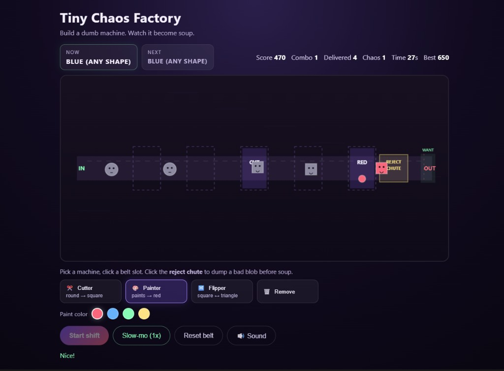

# Tiny Chaos Factory

**Build a dumb machine. Watch it become soup.**

A small browser toy about machines, constraints, chaos, and soup.

## Why I made this

I spend a lot of time building serious operational systems.  
This is the opposite: a tiny chaotic factory where the system is dumb, the rules are simple, and failure becomes soup.

## Play

Open [`index.html`](index.html). No install.

Best on desktop (mouse). Phone works, belt gets fiddly.

## How it works

1. **Start shift** — 8 seconds to place machines, then 60 seconds of orders.
2. **Pick a machine** — Cutter, Painter (pick a color), Flipper, or Remove.
3. **Click a belt slot** — place it on the conveyor.
4. **Reject chute** (yellow box) — dump a bad blob before soup.
5. **Slow-mo** — once per run, if panic hits.

Match the **Now** order at the exit. Chain combos. Beat your best.

## License

MIT — do whatever, just don’t blame me if you become soup.

---

Made by Bogdan Deaky.
